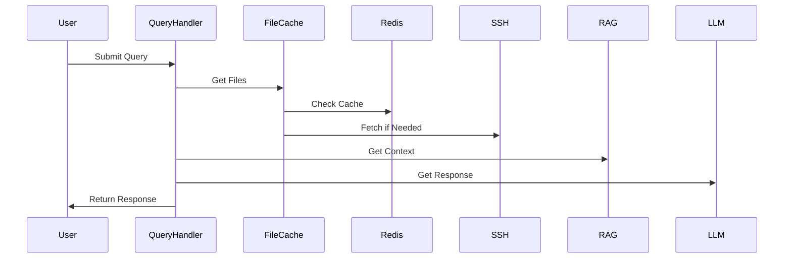
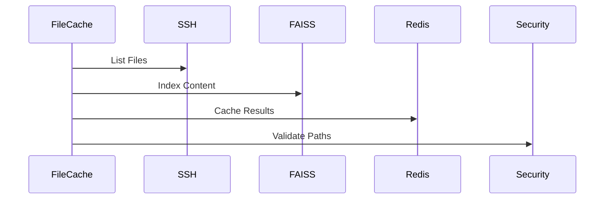

# Current Architecture Implementation

## Core Components

### Query Handler (`query_handler.py`)
- Primary entry point for queries
- Manages file discovery through `file_cache_service`
- Integrates with RAG for context building
- No direct LLM server access
- Async operations

### File Cache Service (`file_cache_service.py`)
- Core file reading component
- Redis caching
- FAISS index management
- Documentation search
- SSH connections pooling
- Path security enforcement

### RAG System
- Hybrid search for file and documentation content
- Vector similarity with FAISS
- Context building from multiple sources
- Response enhancement

## Data Flow

1. **Query Handling**

2. **File Discovery**

## Security Model
- File access through cache only
- Path validation before access
- SSH key-based auth
- No direct LLM server access
